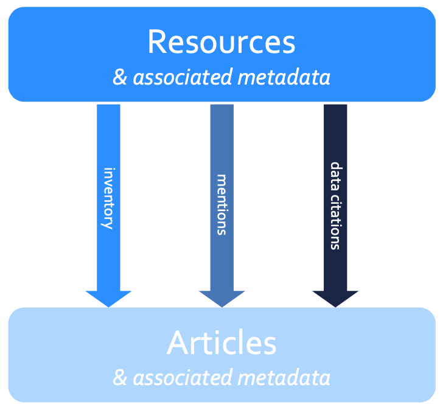
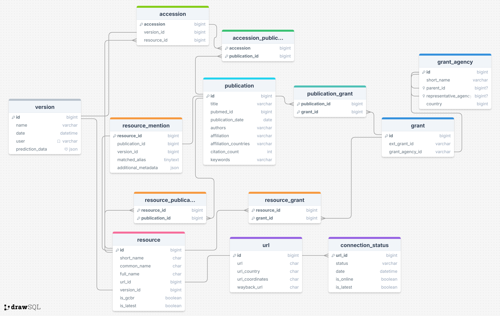

# 🧭 Background

The [Global Biodata Coalition](https://globalbiodata.org) seeks to exchange knowledge and share strategies for supporting biodata resources. To develop an underlying evidence base to show the importance of biodata resources to the life sciences comminity at large, several data analyses were undertaken. All were based on mining published scientific literature, with the help of Europe PMC's APIs.

1. **A global inventory** : The aim here is to identify publications the describe a resources, and form a list of known biodata resources.
2. **Resource mentions** : Here, we wish to capture the usage of these inventory resources by detecting mentions of their names & aliases in open-access full-text articles. This seeks to capture the more informal type of resource citation (outside of official publication references and/or data citations).
3. **Data citations** : Finally, data from these resources can be cited directly by accession number (or other resource-dependent identifier). These are annotated as part of Europe PMC's text-mining service and have been imported into our database as an additional data source.


In essence, the project links biodata resources to scientific publications using three complementary lines of evidence. By combining these into a single, unified schema, we can systematically compare how resources are described, mentioned, and cited across the literature.

This integration allows us to assess how widely each resource is used, identify patterns of citation behaviour, and quantify their scientific impact — providing a clearer picture of how key biodata resources underpin discovery and data reuse in the life sciences.



# 🧭 Introduction

**This repository contains the building blocks required for undertaking much of this analysis.**

In particular, held here is:

- Database schema definitions
- Python classes and methods for interacting with this database
- Utility functions to enable common tasks required across our analyses

# 🧱 Database Schema Overview

The project uses a relational schema to link publications, biodata resources, mentions, and data citations.
At a high level:

- `publication` — article metadata
- `resource` — biodata resources
- `resource_publication` - links resources to their inventory publications
- `resource_mention` — links resources to publications containing text-based name mentions
- `accession` & `accession_publication` — links resources to publications containing citation of their data


👉 [View the full interactive schema diagram](https://drawsql.app/teams/gbc-4/diagrams/gcb-publication-analysis-uber-schema)

👉 [Read full schema documentation](https://globalbiodata.github.io/gbc-publication-analysis/schema/)

#### Schema diagram



# 🧠 Project Structure Overview

```
gbc-publication-analysis/
│
├── globalbiodata.               # Core module with database object classes and helpers
├── gbc_analysis_schema.sql      # Schema definition file (MySQL)
├── gbc_analysis_schema.sqlite   # Schema definition file (SQLite3)
├── gbcutils/                    # Utility modules for parsing, normalisation, database connections, etc.
├── tests/                       # Unit tests for the main module
├── bin/                         # Scripts for analysis operations
└── README.md
```

# 🧑‍💻 Core Modules

> 💡 **API Documentation:**
> Full API reference available at [globalbiodata.github.io/gbc-publication-analysis](https://globalbiodata.github.io/gbc-publication-analysis/)

## globalbiodata

This module contains a number of helpful methods and classes for interacting with GBC data types.

- Object classes for each database table (e.g. Publication, Resource, ResourceMention)
- Each class includes:
    - Fetch / write methods
    - Helper methods for processing
- Documented with Google-style docstrings — see API docs for full details

## gbcutils

- `europepmc` : contains several helpers for interacting with Europe PMC's API's & data
- `db` : helper for opening connections to GBC's Google Cloud SQL instance
- `metadata` : helper methods for sharding & storing article metadata
- `scibert_classify` : helper methods for running ML classifications

# 🧰 Installation & Setup

To install all the required Python modules used by the scripts in this directory, follow the steps below:

## Prerequisites

Ensure you have Python 3.12 installed on your system. You can download it from [python.org](https://www.python.org/).

Install dependencies using
```
pip install -r requirements.txt
```

## Google Cloud Setup & Authentication

The GBC database is hosted on Google's Cloud Platform, so in order to interact with it, we must perform some prior setup.

1. **Install the Google Cloud SDK**

    https://cloud.google.com/sdk/docs/install-sdk

2. **Setup Application Default Credentials (ADC)**

    ```bash
    gcloud auth application-default login
    ```

3. **Install the python connector client**

    ```bash
    pip install "cloud-sql-python-connector[pymysql]"
    ```
    See https://github.com/GoogleCloudPlatform/cloud-sql-python-connector for more information

4. **Clone the repo and run test suite**

    ```bash
    git clone https://github.com/globalbiodata/gbc-publication-analysis.git
    cd gbc-publication-analysis
    export PYTHONPATH=$PYTHONPATH:$PWD
    pytest
    ```

    ✅ If all tests pass you have completed setup!