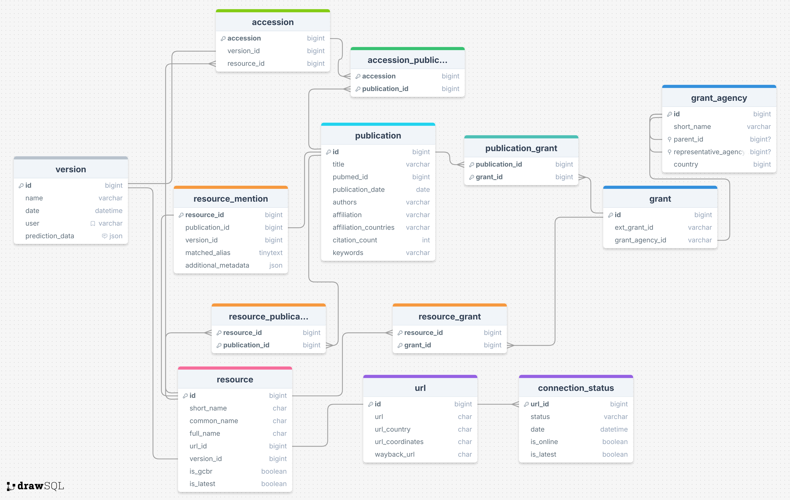

# 🧭 Introduction / Background

The <[Global Biodata Coalition](https://globalbiodata.org)> seeks to exchange knowledge and share strategies for supporting biodata resources. To develop an underlying evidence base to show the importance of biodata resources to the life sciences comminity at large, several data analyses were undertaken.

1. First, a global inventory
2. Mentions
3. Data citations

# 🧱 Database Schema Overview

The schema for our data analysis is fully described in the files `gbc_analysis_schema.sql*`.

### Table overview:
- `resource` : Describes a biodata resource
- `version` : Describes the pipeline/process that identified the resource/accession. Means of versioning.
- `accession` : Described identifier from a biodata resource, found in some published materials
- `publication` : Describes published journal articles
- `resource_publication` : Table to join resource and publication tables, allowing a many-to-many type of relationship
- `url` : Describes URL of a resource
- `connection_status` : Describes ping/connection information for a URL
- `grant` : Describes grants associated with resources/publications and their agencies
- `grant_agency` : Describes grant agencies and their relationship to each other
- `resource_grant` : Table to join resource and grant tables, allowing a many-to-many type of relationship
- `accession_publication` : Table to join accession and publication tables, allowing a many-to-many type of relationship
- `publication_grant` : Table to join publication and grant tables, allowing a many-to-many type of relationship
- `accession` : Holds data citations/accessions plus their associated metadata
- `accession_publication` : Maps accessions to the publications they were found in
- `resource_mention` : Links resources to publications that mentioned the resource's name


### Schema diagram


👉 [View the interactive schema diagram on DrawSQL](https://drawsql.app/teams/gbc-4/diagrams/gcb-publication-analysis-uber-schema)

#### Note: additional tables
2 additional tables are present in the schema definition file, which are largely independent of this analysis work:
- `open_letter` : track the signatures of <[GBC's open letter](https://globalbiodata.org/open-letter-campaign/)>
- `wildsi` : imported data from the <[WilDSI project](https://apex.ipk-gatersleben.de/apex/wildsi/r/wildsi/home)>, about sequence data usage

# 🧰 Installation & Setup

To install all the required Python modules used by the scripts in this directory, follow the steps below:

## Prerequisites

Ensure you have Python 3.12 installed on your system. You can download it from [python.org](https://www.python.org/).

Install dependencies using
```
pip install -r requirements.txt
```

## Google Cloud Setup & Authentication

The GBC database is hosted on Google's Cloud Platform, so in order to interact with it, we must perform some prior setup.

1. **Install the Google Cloud SDK**

    https://cloud.google.com/sdk/docs/install-sdk

2. **Setup Application Default Credentials (ADC)**

    ```bash
    gcloud auth application-default login
    ```

3. **Install the python connector client**

    ```bash
    pip install "cloud-sql-python-connector[pymysql]"
    ```
    See https://github.com/GoogleCloudPlatform/cloud-sql-python-connector for more information


# 🧠 Project Structure

```
gbc-publication-analysis/
│
├── globalbiodata.py             # Core module with database object classes and helpers
├── gbc_analysis_schema.sql      # Schema definition file (MySQL)
├── gbc_analysis_schema.sqlite   # Schema definition file (SQLite3)
├── gbcutils/                    # Utility modules for parsing, normalisation, database connections, etc.
├── tests/                       # Unit tests for the main module
├── bin/                         # Scripts for analysis operations
└── README.md
```

# 🧑‍💻 Core Modules

## globalbiodata

This module contains a number of helpful methods and classes for interacting with GBC data types.

- Object classes for each database table (e.g. Publication, Resource, ResourceMention)
- Each class includes:
    - Fetch / write methods
    - Helper methods for processing
- Documented with Google-style docstrings — see code for full API

#### Example usage
```python
import globalbiodata as gbc
from gbcutils import gbc_db

(gcp_connector, db_engine, db_conn) = get_gbc_connection()

# Fetch a resource by name
resource = gbc.fetch_resource({'short_name':'test_resource'}, conn=db_conn)
print(resource.publications)

# Fetch all publications about this resource
resource_inventory_pubs = resource.publications

# Identify which resources a publication mentions
for inv_pub in resource_inventory_pubs:
    mentioned_resources = inv_pub.mentions()
```

## gbcutils

- `europepmc` : contains several methods for interacting with Europe PMC's API's & data
- `gbc_db` : helper for opening connections to GBC's Google Cloud SQL instance
- `metadata` : helper methods for sharding & storing article metadata
- `scibert_classify` : helper methods for running ML classifications
